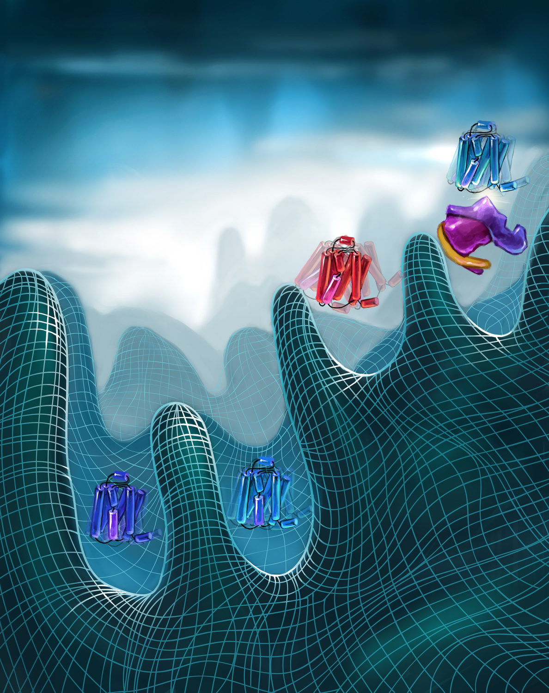

Research in the lab is focused on decoding the molecular basis of transmembrane signaling and transport.
The particular systems we study lie at the intersection of human health and protein science.
We utilize a broad range of methods in structural biology, protein biophysics, pharmacology, and protein engineering to understand how cells recognize and respond to their extracellular environment and maintain intracellular homeostasis.
